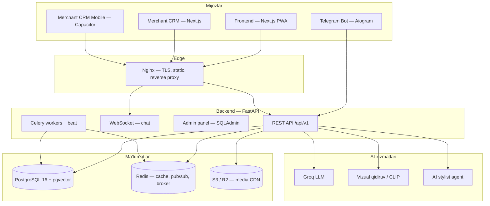

# Bozorliii — arxitektura

Mahalliy bozor uchun AI marketplace: katalog, vizual qidiruv, bron, xarita, merchant CRM va Telegram bot.

## Yuqori daraja



## Monorepo tuzilmasi

| Papka | Vazifa | Stack |
|-------|--------|-------|
| `backend/` | Biznes logika, API, migratsiyalar, bot | Python 3.11, FastAPI, SQLAlchemy, Alembic, Celery |
| `frontend/` | Mijoz web ilovasi (PWA) | Next.js 14, React, Tailwind |
| `merchant-crm/` | Sotuvchi paneli | Next.js 14 |
| `merchant-crm-mobile/` | Sotuvchi mobil ilova | Capacitor + Android |
| `brand/` | Brend aktivlari (manba PNG) | — |
| `deploy/` | Nginx, SSL, server o'rnatish | Bash |
| `scripts/` | Deploy va operatsion skriptlar | Bash, Python |
| `docs/` | Texnik hujjatlar | Markdown |

## Backend — qatlamlar

```
backend/app/
├── interfaces/api/   # REST (*_routes.py) — bitta joyda
├── application/      # Use-case'lar, servislar
├── infrastructure/   # DB, Redis, S3, bot, Celery
├── domain/           # Interfeyslar va entity
├── models/           # Qo‘shimcha ORM (feature modullar)
├── schemas/          # Pydantic DTO
├── services/         # AI stylist, inventory, dispatcher
└── core/             # Config, bootstrap, security
```

To‘liq papka xaritasi: [STRUCTURE.md](./STRUCTURE.md)

## Asosiy domenlar

| Domen | Modullar |
|-------|----------|
| Marketplace | Mahsulot, qidiruv, buyurtma, sharhlar |
| Merchant | Ro'yxatdan o'tish, mahsulot, chat, QR pickup |
| Billing | Obuna, coin, payout, Click/Payme |
| Visual search | Rasm bo'yicha qidiruv, outfit search |
| Map | Do'konlar xaritasi, indoor navigatsiya |
| Loyalty | Mijoz coin tizimi |
| Support | Merchant support ticket + AI |
| Delivery | BTS Express integratsiyasi |

## Ma'lumotlar oqimi (buyurtma)

1. Mijoz `frontend` da mahsulot tanlaydi → `POST /api/v1/orders`
2. Backend zaxira va to'lov holatini tekshiradi
3. Merchant `CRM` yoki `Telegram bot` orqali bildirishnoma oladi
4. Pickup QR orqali topshirish tasdiqlanadi
5. Celery: muddat tugashi, eslatmalar, embedding yangilanishi

## CI/CD

GitHub Actions (`.github/workflows/ci.yml`):

- Frontend + Merchant CRM build
- Playwright E2E
- Backend pytest + migratsiya smoke
- Production Docker image build

## Xavfsizlik

- JWT sessiya (HttpOnly cookie proxy orqali)
- OTP: Telegram + email (Resend)
- Production: `ALLOW_DEV_MOCKS=false`, `RUN_SEED=false`
- To'lov callback IP whitelist
- Rate limiting (Redis)
