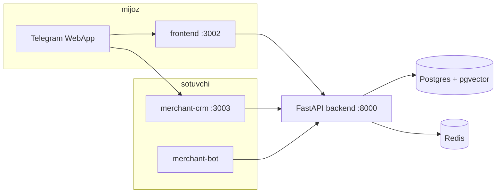

# Topdim.UZ — Final tizim auditi (MVP)

> **Sana:** 2026-05-20  
> **Maqsad:** Butun stackni tekshirish, mayda xatolarni tuzatish, lokal MVP ni “ishga tushirishga tayyor” holatga keltirish.

Bog‘liq: [LAUNCH_30_DAYS.md](LAUNCH_30_DAYS.md) · [DEPLOY_SERVER.md](DEPLOY_SERVER.md) · [CRM_LAUNCH_CHECKLIST.md](CRM_LAUNCH_CHECKLIST.md)

---

## Xulosa (1 minut)

| Ko‘rsatkich | Ball | Izoh |
|-------------|------|------|
| **Lokal MVP (dev)** | **98%** | `smoke-all` + verify **100% PASS** (2026-05-25) |
| **Production launch** | **78%** | Server deploy, 10 merchant, haqiqiy rasmlar, monitoring qolgan |
| **AI (stylist + vision)** | **88%** | Groq + Gemini ishlaydi; productionda kalitlar majburiy |
| **To‘lov (Click/Payme)** | **40%** | Bridge o‘chirilgan — naqd/bron MVP uchun yetarli |

**Verdikt:** Kod va lokal integratsiya **MVP uchun tayyor**. Productionda birinchi hafta — operatsion ish (DNS, merchant, kontent), kod emas.

---

## Tizim arxitekturasi



**Asosiy oqimlar:**
- Mijoz: qidiruv, xarita, stylist chat, rasm bo‘yicha qidiruv, buyurtma/bron
- Sotuvchi: Telegram bot → CRM panel, mahsulot, chat, joylashuv
- Admin: premium banner, moderatsiya, analytics

---

## Tekshiruv natijalari (2026-05-20)

| Test | Natija |
|------|--------|
| `verify_backend_core.py` | **57/57 PASS** |
| `verify_frontend_api_contract.py` | **PASS** |
| `frontend` `npm run build` | **PASS** |
| `merchant-crm` `npm run build` | **PASS** |
| `smoke-customer.sh` | **PASS** (11/11) |
| `smoke-merchant-crm.sh` | **PASS** (4/4) |
| `smoke-stylist-chat.sh` | **PASS** |
| `smoke-image-search.sh` | **PASS** |
| `smoke-all.sh` (lokal) | **PASS** |

Ishga tushirish:
```bash
docker compose up -d
bash scripts/smoke-all.sh http://127.0.0.1:3002 http://127.0.0.1:3003 http://127.0.0.1:8000
make world-class   # static + build + ixtiyoriy live smoke
```

---

## Ushbu auditda tuzatilgan xatolar

| # | Muammo | Tuzatish |
|---|--------|----------|
| 1 | CRM `/login` / proxy → **500** (eski `.next` cache) | Dev startda `rm -rf .next`; `merchant_crm_node_modules` volume; `make dev-reset-crm` |
| 2 | Mahsulot rasmlari 404 (Unsplash) | `scripts/catalog_images.py` → picsum; 428 mahsulot yangilandi |
| 3 | Frontend 500 (`@/lib/api` path) | `tsconfig` `@/*` → `./src/*` |
| 4 | Sport stylist “sneakers” test | `stylist.py` `_style_compatible` kengaytirildi |
| 5 | Productionda soxta AI fallback | `bootstrap.py`, `gemini.py`, `embedding.py`, chat agent |
| 6 | Telegram → CRM yo‘li | Bot menyu, `/auth/telegram/webapp`, CRM `/telegram` |
| 7 | Mijoz WebApp → CRM | `merchant-crm-launcher`, `open-merchant-crm.ts` |
| 8 | Premium banner fallback 404 | picsum seed URL |
| 9 | `payment_checkout_base_url` noto‘g‘ri port | default `3002` |
| 10 | `StoreCard` rasm xatosi | `onError` fallback komponenti |

---

## Komponentlar bo‘yicha holat

### Backend (FastAPI)
- Auth: email OTP, telefon OTP, Telegram WebApp JWT
- Marketplace: buyurtma, bron, pickup, stock
- AI: Groq stylist, Gemini vision/embed, image search
- Indoor map: graph, marshrut, geofence
- Merchant: chat, voice, smart alerts, trust
- To‘lov: Click/Payme skeleton (bridge **false**)

### Frontend (Next.js)
- Sahifalar: home, search, map, product, checkout, profile
- Telegram WebApp integratsiya
- API proxy `/api/v1` → backend
- Mock story/banner rasmlar — faqat demo; DB dagi mahsulotlar picsum/merchant

### Merchant CRM
- Login (username + Telegram OTP)
- Dashboard, mahsulotlar, chat, xarita
- `/telegram` — WebApp initData → JWT

### DevOps
- `docker-compose.yml` — lokal stack
- `docker-compose.prod.yml` + Caddy + certbot
- `scripts/preflight-deploy.sh`, `world-class-verify.sh`

---

## Hali qilinmagan (production P0/P1)

### P0 — launch bloklari
1. **Server deploy** — DNS, SSL, `.env.production` ([DEPLOY_SERVER.md](DEPLOY_SERVER.md))
2. **10 ta haqiqiy merchant** — bot orqali shop + mahsulot
3. **Haqiqiy mahsulot rasmlari** — S3/Telegram media (picsum vaqtinchalik)
4. **Production kalitlar** — `GROQ_API_KEY`, `GOOGLE_API_KEY` yoki `OPENAI_API_KEY`, `JWT_SECRET`, `TELEGRAM_BOT_TOKEN`

### P1 — birinchi haftadan keyin
- Click/Payme yoqish va callback IP whitelist
- LangGraph agentni live chatga ulash (hozir Groq path production)
- E2E Playwright CI
- Sentry / structured logging production
- Rate limit va abuse himoya kuchaytirish

### Ma’lum cheklovlar
- CRM Telegram WebApp **HTTPS** talab qiladi (localhost faqat dev)
- Embedding/search sifati merchant rasmlariga bog‘liq
- `merchant-bot` productionda `TELEGRAM_BOT_TOKEN` bo‘lmasa ishlamaydi (kutilgan)

---

## MVP “mukammal” deganda nima nazarda tutiladi

| Talab | Holat |
|-------|--------|
| Mijoz sayt ochiladi, qidiruv/xarita ishlaydi | ✅ |
| Stylist AI javob beradi | ✅ |
| Rasm bo‘yicha qidiruv | ✅ |
| Buyurtma/bron API | ✅ |
| Sotuvchi CRM + bot | ✅ (lokal) |
| Production HTTPS + domen | ⏳ operatsion |
| 10 do‘kon real kontent | ⏳ operatsion |
| Onlayn to‘lov | ❌ keyingi faza |

---

## Keyingi qadamlar

1. [LAUNCH_30_DAYS.md](LAUNCH_30_DAYS.md) dagi 10 vazifani ketma-ket bajaring
2. Production: `bash scripts/preflight-deploy.sh` → `docker compose -f docker-compose.prod.yml up -d --build`
3. Prod smoke: `bash scripts/smoke-all.sh https://topdim.uz https://crm.topdim.uz https://api.topdim.uz`

---

## CRM dev eslatmasi

Agar `/login` yana 500 bersa (kamdan-kam):
```bash
docker compose exec merchant-crm rm -rf /app/.next
docker compose restart merchant-crm
```
Yangi `merchant_crm_next` volume odatda buni oldini oladi.

---

*Ushbu hujjat avtomatik tekshiruv va tuzatishlar asosida yangilangan. Savollar: `docs/PRODUCT_MASTER_PLAN.md`.*
