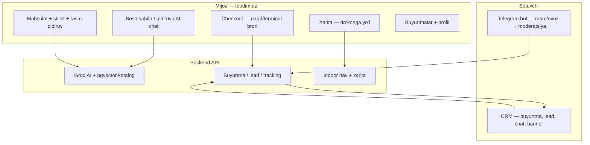

# Topdim.UZ — Tayyor mahsulot rejasi (Mijoz + CRM + Bot)

> **Qisqa xulosa:** Sizda allaqachon **haqiqiy startup MVP** bor — Ippodrom uchun pickup-marketplace, AI stilist, xarita, bron, merchant CRM va Telegram bot bir tizimda. Bu “g‘oya” emas, **deploy qilinadigan mahsulot**. “Dunyo darajasi” va “to‘liq unicorn” uchun quyidagi P0 → P1 → P2 ketma-ketligi kerak.

---

## 1. Hozir nima bor? (Startup logic)



| Qatlam | Tayyorlik | Nima ishlaydi |
|--------|-----------|----------------|
| **Mijoz web** | ~85% | Katalog, AI chat/stilist, rasm qidiruv, bron, xarita, auth, buyurtmalar |
| **CRM** | ~80% | Login OTP, buyurtma/lead/chat, mahsulot, moderatsiya, banner (tanga), xarita |
| **Telegram bot** | ~75% | `/start`, kontakt, rasm→AI listing, ovoz (Whisper), OTP, smart alert |
| **Biznes** | ~70% | Bron + zaxira, lead, premium banner, shop trust (API), indoor yo‘l |
| **To‘lov** | ~40% | Naqd/terminal **ON**; Click/Payme kod bor, **default OFF** |
| **AI chuqurligi** | ~75% | Groq + vector — **production yo‘l**; LangGraph yozilgan, lekin live chatga ulanmagan |

---

## 2. Ideal biznes modeli (Ippodrom → global)

### Mijoz qiymati
1. **Topdim** = “bozorning Google + stilist” — matn/rasm bilan mos kiyim topish.
2. **Bron** = do‘konga kelish vaqtini band qilish (hozir: naqd/terminal).
3. **Xarita** = qayerda ekanini bilish (Ippodrom ichki yo‘l + Yandex tashqari).

### Sotuvchi qiymati
1. **Telegram** = rasm yubor → mahsulot qatorga (moderatsiya).
2. **CRM** = buyurtma, lead, chat, reklama (banner/tanga).
3. **Analitika** = qaysi yo‘ldan mijoz keldi (qisman: heatmap API bor, UI to‘liq emas).

### Platforma daromadi (keyinchalik)
| Manba | Holat |
|-------|--------|
| Premium banner (tanga) | ✅ Kod tayyor |
| Lead / featured do‘kon | ✅ Qisman |
| Tranzaksiya komissiyasi (Click/Payme) | ⏸ Muzlatilgan |
| Obuna (CRM Pro) | ❌ Hali yo‘q |

---

## 3. Nimalarni yaxshilash kerak?

### 🔴 P0 — “Tayyor product” (launch uchun shart)

| # | Vazifa | Nima qilish |
|---|--------|-------------|
| 1 | **Production `.env`** | `GROQ`, `GOOGLE`/`OPENAI`, `JWT`, `TELEGRAM`, `RESEND`, `YANDEX_MAPS`, `CORS`, TLS |
| 2 | **Katalog to‘ldirish** | `seed_bulk_ippodrom.py --reembed`, `reembed_products.py` |
| 3 | **Merchant onboarding** | Admin: do‘kon + `owner_phone` → bot `/start shop_<id>` → CRM login |
| 4 | **Mock o‘chirish** | `NEXT_PUBLIC_ALLOW_DEV_MOCKS` **yo‘q** productionda |
| 5 | **Media S3** | Rasmlar CDN/S3 — placeholder emas |
| 6 | **Smoke** | `smoke-all.sh` + 5 daqiqa manual (deploy doc) |
| 7 | **Pickup-only qabul** | Click/Payme yoqilmaguncha mijozga faqat naqd/terminal |

**P0 bajarilsa = sizda “tayyor mahsulot” (Ippodrom pickup marketplace).**

### 🟡 P1 — Kuchaytirish (world-class)

| # | Vazifa | Sabab |
|---|--------|--------|
| 1 | **Stories** bosh sahifada | Kod bor, UI ulanmagan — Instagram effekt |
| 2 | **CRM Shop Trust** ekrani | API bor, merchant KPI ko‘rmaydi |
| 3 | **Haqiqiy sharhlar** | Hozir demo reviews — ishonch past |
| 4 | **Analytics dashboard** | Heatmap API bor — alohida CRM sahifa |
| 5 | **Bot Redis FSM** | Restartda state yo‘qolmasin |
| 6 | **LangGraph** — ulash yoki olib tashlash | Ikki AI stack chalkashlik |
| 7 | **Payme webhook** | Tanga to‘ldirishda Click bilan teng |
| 8 | **E2E testlar** | Bron + OTP Playwright |
| 9 | **Metrika / Sentry** | Production kuzatuv |

### 🟢 P2 — Qoʻshish (unicorn / masshtab)

| # | Vazifa |
|---|--------|
| 1 | Mijoz **Telegram Mini App** (browse + bron) |
| 2 | **Click/Payme** mijoz checkout + shop payout |
| 3 | **Shaxsiy taste profil** (har safar AI yaxshiroq) |
| 4 | **In-app indoor navigation** (ko‘k nuqta, qavat avto) |
| 5 | **POS integratsiya** (real vaqt qoldiq) |
| 6 | Ko‘p bozor (Abu Sahiy va h.k.) — bitta kod, ko‘p `market_slug` |

---

## 4. Startup logic — ideal vs hozir

| Oqim | Ideal | Hozir |
|------|-------|-------|
| Mijoz topadi | AI + vector + filter | ✅ Groq + pgvector |
| Mijoz bron qiladi | To‘lov + SMS/TG xabar | ✅ Bron; to‘lov naqd |
| Sotuvchi listing | Rasm → AI → 1-tasdiq → live | ✅ Bot → moderatsiya |
| Sotuvchi sotadi | CRM + bildirishnoma | ✅ CRM + TG alert |
| Platforma o‘sadi | Lead, banner, analytics | ✅ Qisman |
| Ishonch | Sharh + trust score | ⚠️ API bor, UI zaif |
| Qayta kelish | Profil + tavsiyalar | ⚠️ Session/feedback, to‘liq emas |

---

## 5. “Tayyor product” ta’rifi

**Siz so‘ragan “boldi, tizim tayyor” = P0 bajarilgan holat:**

- [ ] `https://topdim.uz` — mahsulot, AI, bron, xarita
- [ ] `https://crm.topdim.uz` — merchant ishlaydi
- [ ] Telegram bot — listing + OTP
- [ ] 300+ mahsulot embedding bilan
- [ ] Smoke 100% + 10 ta haqiqiy merchant onboard

**“Mukammal / unicorn” = P0 + P1 + qism P2** (oylar ish).

---

## 6. 7 kunlik launch rejasi

| Kun | Ish |
|-----|-----|
| 1 | Server, DNS, `.env`, `preflight-deploy.sh` |
| 2 | `docker compose prod up`, migratsiya, smoke |
| 3 | Katalog seed + reembed, rasmlar S3 |
| 4 | 5–10 do‘kon onboard (admin + bot + CRM) |
| 5 | AI smoke (stilist, rasm), xarita test |
| 6 | Mijoz + merchant manual QA |
| 7 | Soft launch Ippodrom (pickup-only) |

---

## 7. Tezkor buyruqlar

```bash
# Local CRM
open http://localhost:3003/login

# Production deploy
./scripts/preflight-deploy.sh
docker compose -f docker-compose.prod.yml up -d --build
./scripts/smoke-all.sh https://topdim.uz https://crm.topdim.uz https://api.topdim.uz

# Katalog
docker compose exec backend python /app/scripts/seed_bulk_ippodrom.py --target 300 --reembed
```

---

## 8. Xulosа (sizga to‘g‘ridan-to‘g‘ri)

| Savol | Javob |
|-------|--------|
| Startup logic bormi? | **Ha** — mijoz → AI → bron → xarita; sotuvchi → bot → CRM |
| Biznes ideal bormi? | **Asosi bor** — lead, banner, trust API; to‘lov va analytics to‘liq emas |
| Tayyor product bormi? | **MVP tayyor** — deploy + katalog + merchant = launch |
| Nima yaxshilash? | P0: env, seed, mock off, onboarding |
| Nima kuchaytirish? | P1: stories, trust UI, analytics, bot FSM, reviews |
| Nima qo‘shish? | P2: Mini App, online pay, taste profile, indoor nav |

**Keyingi qadam:** P0 ni serverda bajarish. Kod bazasini “noldan yozish” shart emas — **to‘ldirish va ulash** kerak.

Bog‘liq: [DEPLOY_SERVER.md](DEPLOY_SERVER.md) · [CRM_LAUNCH_CHECKLIST.md](CRM_LAUNCH_CHECKLIST.md) · [STYLIST_AI.md](STYLIST_AI.md)
