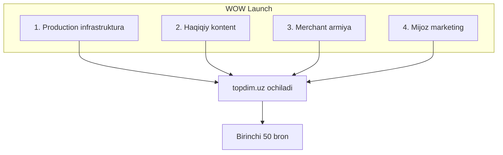

# Topdim.UZ — WOW Launch (oddiy MVP emas)

> **Maqsad:** Ippodromda mijoz *“vau, bu professional”* desin — Instagram + Yandex Maps + AI stilist bir joyda.

Bog‘liq: [LAUNCH_30_DAYS.md](LAUNCH_30_DAYS.md) · [DEPLOY_SERVER.md](DEPLOY_SERVER.md) · [MERCHANT_SELF_SERVICE.md](MERCHANT_SELF_SERVICE.md)

---

## WOW launch nima?

| Oddiy MVP | WOW launch |
|-----------|------------|
| 3 do‘kon, test rasmlar | 30+ do‘kon, **haqiqiy** rasmlar |
| `localhost` demo | `https://topdim.uz` + SSL |
| Admin qo‘lda ulaydi | `/register` + **admin tasdiq** |
| Mock stories/banner | Faqat DB dagi kontent |
| “Ishlaydi” | **Tez, chiroyli, ishonchli** |

**WOW = mijoz + sotuvchi + siz** uchun birinchi haftada haqiqiy trafik va bron.

---

## Hozir qayerdasiz? (halol)

| Qatlam | % | Izoh |
|--------|---|------|
| Kod / arxitektura | **88** | Tayyor |
| Self-service merchant | **85** | `/register` + login/parol |
| Production deploy | **0** | Siz qilasiz |
| Kontent (haqiqiy) | **20** | Seed/picsum → almashtirish kerak |
| “Wow” taassurot | **55** | Deploy + kontent + marketing |

**Xulosa:** Kod **WOW ga yaqin**, taassurot **deploy va operatsiyadan** keladi.

---

## 4 ustun (barchasi kerak)



---

## 1. Production infrastruktura (kun 1–5)

- [ ] VPS 4GB+, Docker, DNS, SSL
- [ ] `.env` to‘liq (GROQ, GOOGLE, JWT, TELEGRAM, RESEND, YANDEX, S3)
- [ ] `preflight-deploy.sh` → PASSED
- [ ] `docker compose -f docker-compose.prod.yml up -d --build`
- [ ] `smoke-all.sh` HTTPS → PASS
- [ ] `NEXT_PUBLIC_ALLOW_DEV_MOCKS` **yo‘q**
- [ ] Sentry + Yandex Metrika (ixtiyoriy lekin WOW uchun tavsiya)

**Belgi:** Do‘stingiz telefondan `topdim.uz` ochadi — 502 yo‘q, AI javob beradi.

---

## 2. Haqiqiy kontent (kun 3–14)

- [ ] `MEDIA_STORAGE_BACKEND=s3` — barcha rasmlar CDN
- [ ] Har do‘kon: **fasad + 10+ mahsulot** (bot orqali)
- [ ] `reembed_products.py` — qidiruv/stilist aniq
- [ ] Eski placeholder/404 rasmlar yo‘q

**Belgi:** Bosh sahifa scroll — hech qayerda buzilgan rasm yo‘q.

---

## 3. Merchant armiya (kun 5–21)

- [ ] **30 do‘kon** `/register` (yoki siz yordam)
- [ ] Admin tasdiq: `GET /admin/shops/pending` → `PATCH .../verify`
- [ ] Har do‘kon: 1 egasi CRM da login qilgan, 3+ mahsulot published
- [ ] 2 ta “yulduz” do‘kon — featured banner

**Admin tasdiq (curl):**
```bash
curl -H "X-Admin-Key: $ADMIN_API_KEY" https://api.topdim.uz/api/v1/admin/shops/pending
curl -X PATCH -H "X-Admin-Key: $ADMIN_API_KEY" \
  https://api.topdim.uz/api/v1/admin/shops/SHOP_UUID/verify \
  -d '{"verified":true}'
```

**Belgi:** 30 tasdiqlangan do‘kon, xaritada pinlar to‘liq.

---

## 4. Mijoz marketing — “wow” moment (kun 10–30)

| Kanal | Nima |
|-------|------|
| Instagram/TikTok | “Topdim — kiyim top, bron qil, do‘konga kel” |
| Ippodrom ichida | QR → `topdim.uz` |
| 20 ta influencer/tanish | Birinchi bron bepul promo |
| Stilist demo | “Qora kurtka 500 ming” → 3 ta real mahsulot |

**WOW momentlar (mijoz):**
1. AI 10 soniyada 3 ta mos kiyim
2. Rasm yuklash → o‘xshash mahsulotlar
3. Xaritada do‘kon + yo‘l
4. Bron 2 bosqichda

---

## P1 — WOW dan keyin “world-class” (30–90 kun)

| # | Vazifa |
|---|--------|
| 1 | Stories bosh sahifada (kod bor) |
| 2 | Haqiqiy sharhlar + trust badge |
| 3 | Click/Payme |
| 4 | Bot FSM → Redis |
| 5 | CRM analytics dashboard |
| 6 | Telegram Mini App (mijoz) |

---

## Kunlik reja (qisqa)

| Kun | Ish |
|-----|-----|
| 1–3 | Server + deploy + smoke |
| 4–7 | 10 do‘kon register + tasdiq + rasmlar |
| 8–14 | 30 do‘kon, reembed, QA |
| 15 | Soft launch (Instagram + QR) |
| 16–30 | Support, 50+ bron, iteratsiya |

---

## “WOW launch bo‘ldi” belgisi

- [ ] `topdim.uz` — tez, SSL, mock yo‘q
- [ ] 30+ **tasdiqlangan** do‘kon
- [ ] 300+ mahsulot, haqiqiy rasmlar
- [ ] AI + rasm qidiruv demo video tayyor
- [ ] Birinchi hafta **50+ bron**
- [ ] 5 ta sotuvchi: *“mijozlar Topdim orqali keldi”*

---

## Sizning rol

| Rol | Vaqt |
|-----|------|
| **Founder / ops** | Do‘konlarni yig‘ish, tasdiq, support |
| **Dev** | Deploy, monitoring, bugfix |
| **Content** | 1 ta launch video (30 sek) |
| **QA** | Har yangi do‘kon — 5 daqiqa test |

**WOW launch = 70% operatsiya, 30% kod.** Kodingiz tayyor — endi **sahna** kerak.
